# My words of the "OneShot"
***

# 正经评测：一部触动人心的Metagame艺术做品
> 本作是我玩过的最能触动人心的Metagame！

***
***
## 前言

说来惭愧，最初我还是从《君与彼女》接触到Metagame这一类型 **（小孩子不要好奇那是什么）** 。
要说这个题材最吸引我的地方，就是其打破次元壁直接与玩家，也就是屏幕外的你而不是你操纵的角色进行交流，带来的代入感与震撼。这个题材往往有着突破传统格局的剧情，与颠覆一般游戏的交互设计。

如大名鼎鼎的Undertale，通过穿透表层游戏存档机制的剧情，使玩家失去了回档重来这一从游戏内世界角度来看的逆天作弊，让玩家感受着自己的行为的代价。

如大名鼎鼎x2的DDLC **（小孩子不要好奇那是什么x2）**，通过让玩家直接在游戏外操作文件来影响游戏内，令人感到真的是自己而不是游戏角色在进行游戏。

如大名鼎鼎x3的尼尔机械纪元，E结局里辅助剂与玩家的直接对话，最后的弹幕时全球玩家的支援，将玩家自己带入到游戏中去改变角色们的结局与命运。

~~_（还有在圈内大名鼎鼎的君彼，犹记得美雪隔着屏幕和自己而不是男主角那啥时的刺激，当然，也忘不了被敲棍时手机突然抖动吓得差点甩出去的恐惧。。。小孩子不要好奇x3）_~~

如果说元编程与宏是程序中最难驾驭但又威力惊人的赫格尼之剑，那么Metagame就是游戏中的提尔锋，这个题材的游戏总是伴随着指责与争议。

Metagame把游戏从虚拟娱乐提到了现实生活中来。它试图补上传统游戏中缺失的伦理道德与善恶价值，轻则拷问良心令玩家难受，重则，呃，DDLC的相关事件我不想再传播。。。 **（小孩子不要好奇那是什么x3）**

然而在电影、绘画、文学中，其实这样的内容多得是，归根结底，游戏还是一个比较新兴的艺术载体，更多人甚至只把它看作是一种存粹的娱乐方式。

但这是不公平的，引用村上春树的一句话： **“电子游戏比任何东西都更接近文学”** ，我觉得我们有必要更加重视游戏的文学与艺术价值。

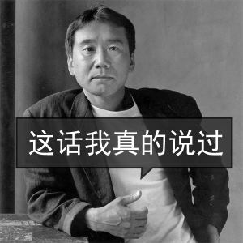

***
***
## 剧本

算了扯远了，回到本作，剧情围绕一个小男喵拯救世界展开，加上萌萌的主人喵，本身话题敏感度比较低。（Niko：要说几次我不是猫！我不吃老鼠！）

但虐心的地方还是有的，毕竟是Metagame。最“恶心人”的地方大概就是一周目结局时，拯救世界还是拯救Niko的二难选择了。

然而好在本作将这把提尔锋包裹的很厚实，在让玩家做出最终选择之前，有一系列的感情铺垫。

比如，在一周目最后去塔底之前，剧情会引导玩家去往咖啡厅，让Niko酱最后饱饱的吃上一顿薄煎饼。这时Niko酱会回忆起他的妈妈，会像个孩子一样脆弱的哭泣。

（图里的Niko颜色有点失真是因为我这是第三周目了，特意回来截图只能这样）

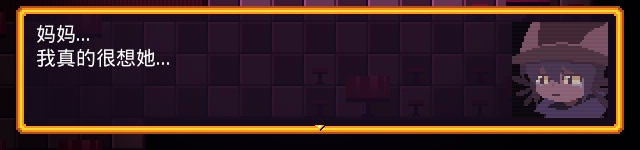

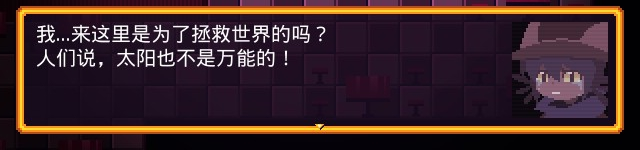

这时玩家怎么会不想起，这个一步步克服诸多艰难险阻来到这里的小男喵，其实真的还是个孩子。玩家会心软，会心疼。

Niko酱说的话，还有之前Niko醒来时的梦，进一步提醒了玩家结局可能不是童话，会让玩家提前思考是不是真的该让这个小男喵去承担那么重的责任。

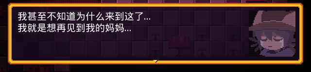

Niko想见妈妈这个强烈的愿望，直接导致我一周目最后基本没什么犹豫的选择了让他回家。至于世界毁灭良心痛不痛，痛，但是只要我对我自己的信念坚定不移，好像也就没那么痛了。

***
又比如，如果玩家收集齐了支线任务物品，成功栽下了植物精灵Maize的种子，Niko酱会很开心。

（这里忘了截图，这是借别人通关视频补的，所以Niko是彩色的）

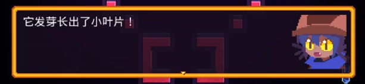

而这时候玩家再面临二难选择时，因为玩家对这个世界接触的很仔细，了解了这个世界许许多多的人和事才能收集全支线任务物品（很可能是三周目了），那么玩家（比如我）更可能做出拯救世界的选择。

但别误会，比起“上回选了A这回选B”这种微不足道的事情（好奇派），我更喜欢“既然以前选A那么这次也选A”（坚定派），事实上我三周目也确实还是选择了回家，四周目全称就了才选择了拯救世界。为什么呢，因为我对这个游戏中的世界有了更深的了解，而亲手种下的种子也让我对这个世界有了期待。

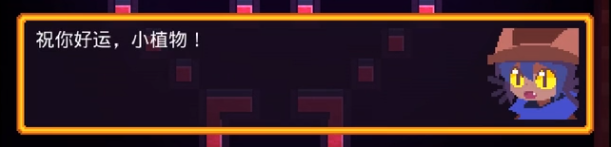

我想Niko酱大概也是这样的，他的大眼睛闪闪发光，小虎牙满溢着祝福与喜悦，他应该也是由衷的期待着这个小植物的生长，期待着Maize的复生。那么我想，最后我让他选择世界，他或许不能减少一分悲伤，但至少能多一些希望了吧。或许他可以在复苏后的世界里转一转，与新世界认识的朋友们玩耍，体会体会当了回小英雄的自豪，说不定还能迎来和Maize的重逢。

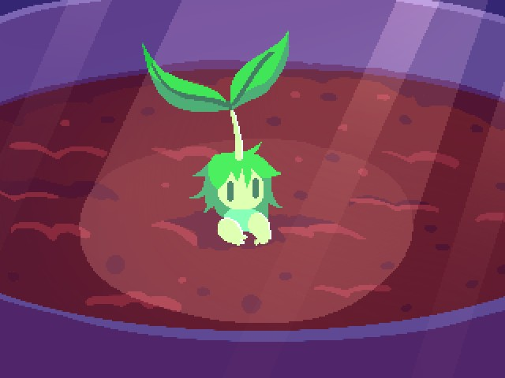

***
总之，我想其实玩家怕的并不是二难选择，也不是严肃的结局。玩家怕的是骤然面临的命运，怕的是突如其来的强迫。而本作在这个方面处理的很好，以至于我哪怕是刚通一周目没开二周目前，也能对这个不圆满的结局比较释怀。（不过听说本作的二周目是后来才更新的，如果这里没处理好，那么我估计作者家早被刀片淹没了。。。）

***
***
## 感情

多说一点。不同于以往的Metagame，虽然是打破次元壁让玩家置身于故事中，但本作并未因此消减主角的地位。相反，本作对玩家与主人喵的感情刻画非常出彩。

Niko对你十分信任与依赖，一周目假结局前，Niko最后的遗憾是没能和你好好告别。而当你解锁了真结局叫醒他时，他大大的眼睛里满是你回来了的惊喜与开心。

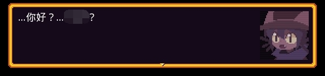

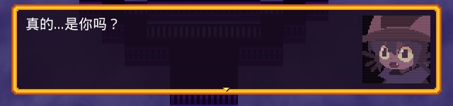

他不怀疑你去哪儿了，不知道前方有怎样的命运等着他，他只是坚定的以为这次就是真结局、好结局，因为你回到了他的身边。

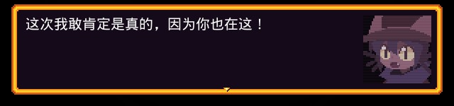

但最后，当你亲口告诉他一切，他不追问你是何时从何得知，也不责怪你的隐瞒与背叛。他只是有些迷惘，但他仍然信赖这你，甚至将自己的命运交给你来抉择。当你说选择世界，他毫不犹豫的接受了你的选择，宝石般的瞳孔看不到一丝阴霾。

***
***
## 结语

我惊叹于作者竟然把这个小男喵刻画的如此深入人心惹人怜爱，他和他冒险过的那个世界，我久久不能忘怀。

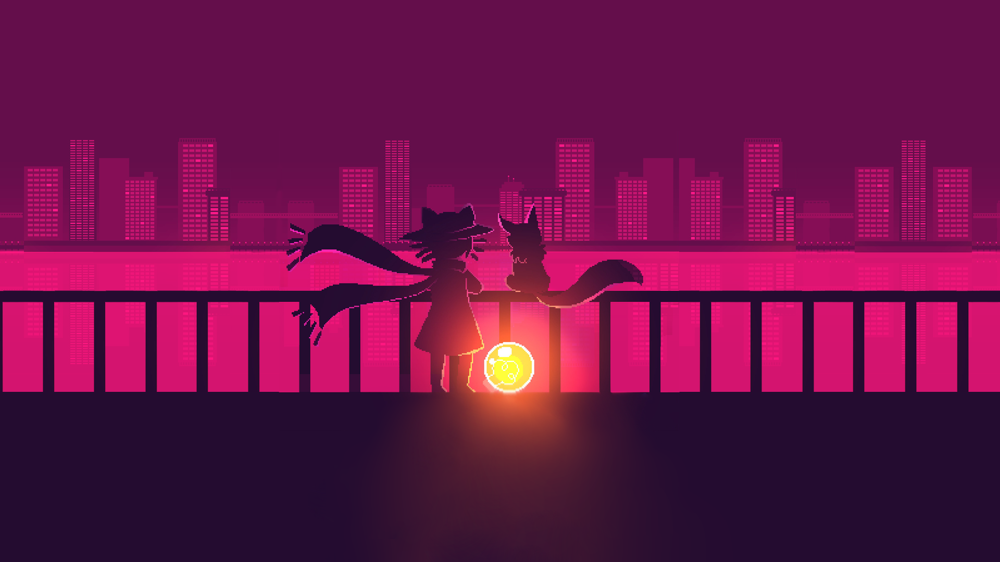

***
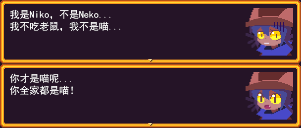
